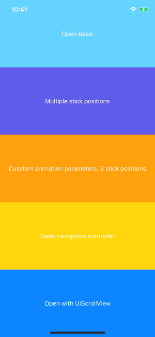

# MMMCardModal

An iOS 13 insipred modal card presentation, however you can specify multiple stick postions for the presented VC.

(This is a part of `MMMTemple` suite of iOS libraries we use at [MediaMonks](https://www.mediamonks.com/).)

## Demo



## Most basic example

```swift

class MyVC: CardModal.ViewController {

  init() {
      super.init(view: MyView())
  }

}

present(MyVC(), animated: true)

```

## Installation

Podfile:

```ruby
source 'https://github.com/mediamonks/MMMSpecs.git'
source 'https://cdn.cocoapods.org/'
...
pod 'MMMCardModal'
```

SPM:

```swift
.package(url: "https://github.com/mediamonks/MMMCardModal", .upToNextMajor(from: "0.2.13"))
```


## More detailed example

Just checkout the code in `/Example/ViewController.swift`.

## Details

Subclass the `CardModal.ViewController` for a single modal,
or `CardModal.NavigationHost` to support navigation controllers. You can conform the
controllers in your `NavigationController` to `ChildControllerDelegate` to get access
to the `NavigationHost` and the delegate callbacks to detect closing & position changes.

Make sure to have the reference to the parent `navigationHost` defined as `weak` to avoid
cyclic references.

It's possible to specify multiple `StickPosition`s, this defaults to `.top`, but can be `.center`
or a custom value. The first value in the `stickPositions` array is the position the modal will open
to when presenting.  E.g. `.percentage(0.2)` will open the modal 20% from the top of the screen.

More options are available and can be set after `super.init()`, for more info
checkout `CardModal.Options.swift`.

**Required:**
 - If you implement `cardModalWillDragToClose` you will have to to close the presented controller
 yourself (and usually do some cleaning up). You can dismiss the presented controller with animation,
 because then the StatusBar will animate along nicely. If you use the `NavigationHost` you should close
 that instead of the controller, since that is presented. Get a reference to this by conforming to the
 protocol `ChildControllerDelegate`.
 - You should always supply at least one `StickPosition` in the  `stickPositions` array.

**Optional:**
 - The `cardModalDidDrag(_ to: )` callback is optional, but can be useful to alter the UI based
 on the `currentPosition`. The `currentPosition` is the `StickPosition` that is active.
 - Set custom options by modifying `self.options` after initializing. If you want to edit the options
 after the init call, you should override it with a new `CardModal.Options` object.
